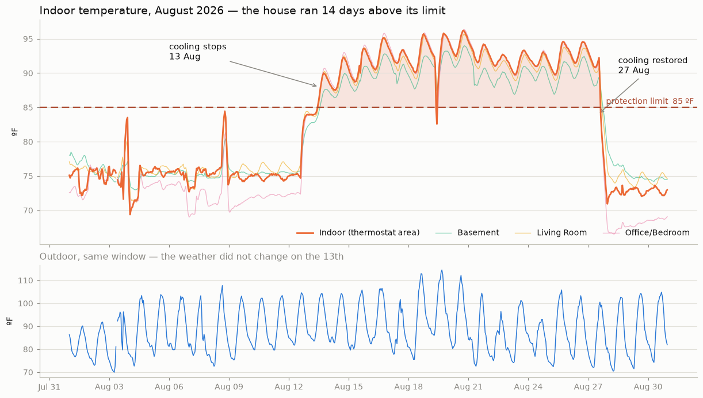
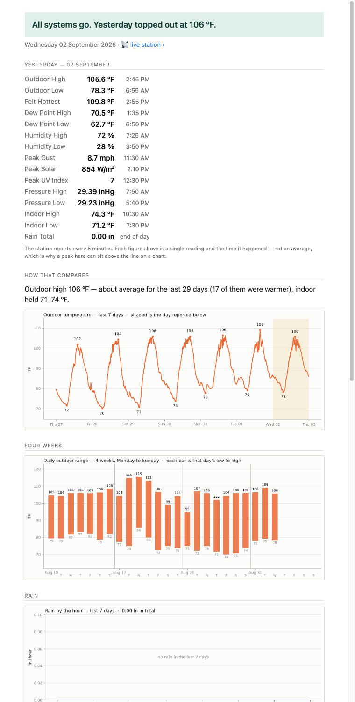
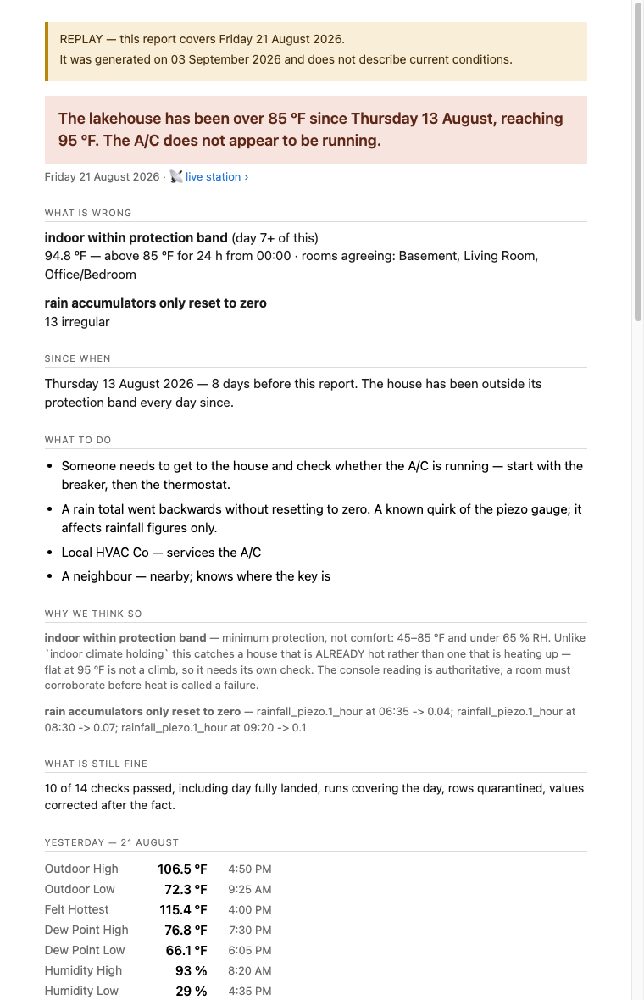
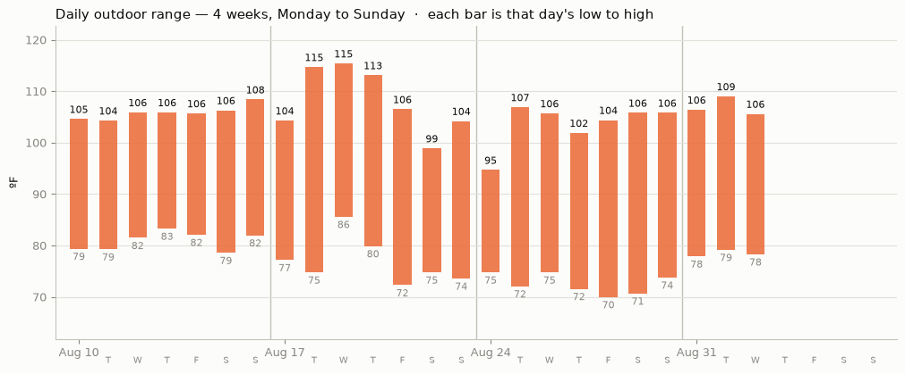
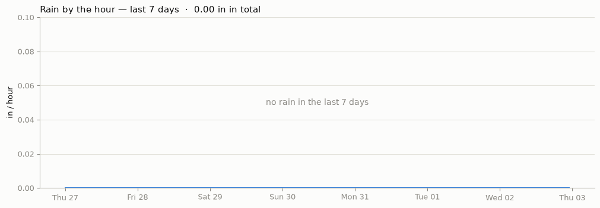
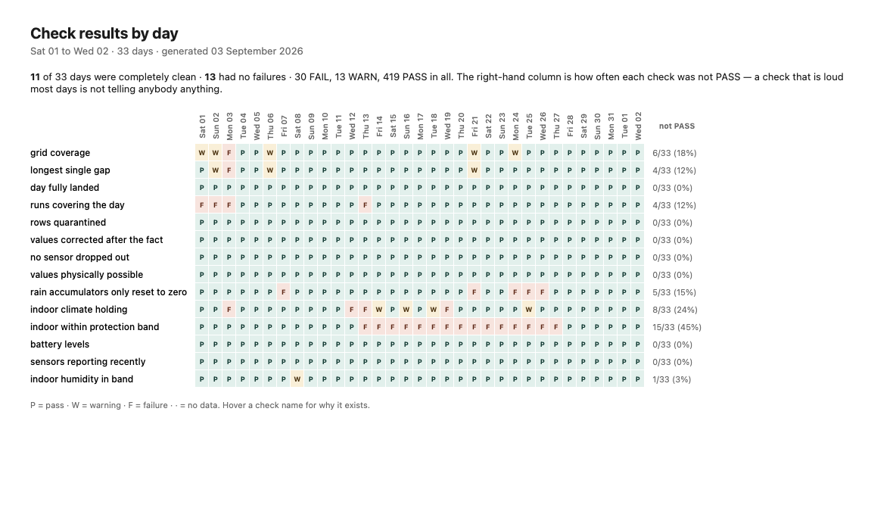
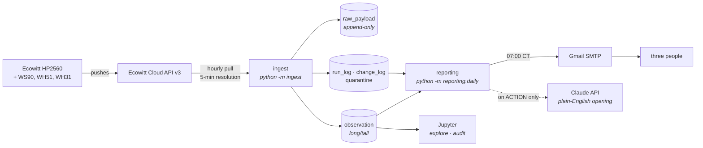

# Ecowitt Weather → PostgreSQL → a daily email that answers one question

A weather station at a lake house in rural Oklahoma reports every five minutes.
This project pulls that data into PostgreSQL on GCP, checks whether the day is
fit to report on, and emails three people each morning: **is the house all
right?**

It found a two-week air-conditioning failure that nobody had noticed.



The house sat above its 85 °F protection limit for **14 consecutive days**, from
13 to 27 August. Outdoor temperature is unchanged across the same window — the
weather did not do this. The step change is the compressor stopping.

---

## Why the obvious check would have missed it

The first indoor check keys on a **sustained climb** — hourly means rising
without reversing. It was calibrated against a real failure: 9.27 °F over nine
hours, against a normal day's largest continuous rise of 2.88 °F. A plain rate
threshold cannot separate those, because the fastest two-hour rise on a normal
day (6.2 °F) is almost the same as the failure's (6.7 °F).

That check is correct, and it would never have caught this. **A house that is
already hot is not climbing.** Flat at 95 °F produces no run of rising hourly
means, so it passes cleanly, every day, for two weeks.

So there are two checks doing different jobs:

| Check | Catches | Why both |
|---|---|---|
| `indoor climate holding` | cooling failing **while still in band** | early warning, hours before anything is uncomfortable |
| `indoor within protection band` | the **state**, not the transition | fires on day one of a hot house and every day after |

Replayed over the whole record, the second fires on exactly 13–27 August and on
no earlier day. That reproduction *is* the acceptance test — a check that cannot
reproduce the incident that motivated it is not calibrated yet.

---

## The email

Most mornings it is a digest. When something needs a person, it is not.

| A normal morning | A morning that needs someone |
|---|---|
|  |  |

**Conclusion, then evidence** — never evidence with the conclusion left for the
reader to assemble. The verdict is the first line. On an ACTION email, *what is
wrong*, *since when* and *what to do* all come before the data that says so.

Two of the three readers are not technical, which drives most of the design:

- **The subject is a sentence**, not a status code:
  `Lake house Ecowitt System checks are good for Wed, Sep 2nd`
- **`ATTENTION` is capitalised and "good" is not** — the shape of the word is
  caught before it is read
- **Times are 12-hour and right-aligned**, so `6:40 AM` sits under `10:00 PM` on
  the colon
- **The text alternative stands alone.** Gmail defers images from unfamiliar
  senders, so if every chart is blocked the email still delivers its verdict,
  its numbers and its action
- **Contacts appear only when the *house* is the problem.** A failed ingestion
  run must not send a neighbour to an empty house

### Charts

Drawn with matplotlib, embedded as CID parts so they render without a click.

| | |
|---|---|
|  | Daily high-to-low bars, four Monday-to-Sunday weeks. The y-axis deliberately excludes zero — nothing here goes near 0 °F, and a zero baseline would compress every bar into the top third. |
|  | Hourly rainfall over seven days. Read from the station's own "rain in the last hour" rather than differencing a daily accumulator that resets at midnight. |

Three rules the charts follow, none cosmetic:

- **Gaps are drawn as gaps.** Frames are reindexed onto a complete time grid, so
  a dropout is `NaN` and matplotlib leaves a visible break. Bridging it would
  draw a line through readings that were never taken.
- **Readable in greyscale.** Limits are dashed lines, not shaded bands: a tint
  behind a trace mutes the trace, and these get printed.
- **Peaks match the table.** See [aggregation](#a-chart-that-disagreed-with-its-own-table).

---

## What it checks

Fourteen checks run against every day, each returning a verdict, a number and a
sentence. None of them may raise — a report that dies on its own health check
tells you nothing about the weather.

| | Check | Asks |
|---|---|---|
| **The house** | `indoor within protection band` | is it being held somewhere it will not damage itself — 45–85 °F, under 65% RH |
| | `indoor climate holding` | is cooling failing while still in band |
| | `indoor humidity in band` | condensation and mould risk |
| **The instruments** | `sensors reporting recently` | how long since each metric last reported |
| | `no sensor dropped out` | did something reporting yesterday stop |
| | `battery levels` | will we still be able to see the house next week |
| **The day's data** | `grid coverage` | how many of the day's 5-minute slots landed |
| | `longest single gap` | one 40-minute hole and eight scattered singles both read as "97% covered" |
| | `day fully landed` | has the day finished arriving before it is reported on |
| | `runs covering the day` | did the pipeline actually run |
| | `values physically possible` | is anything outside what its sensor can report |
| | `rows quarantined` | were rows rejected and kept |
| | `values corrected after the fact` | did reconciliation rewrite history |
| | `rain accumulators only reset to zero` | a fall that is not a reset means a total went backwards |

`python -m reporting.matrix` renders every check against every day:



That grid is not decoration — it is how a check earns its place. One check
(`no flatlined sensor`) warned on **4 of 27 days and was right on none of them**:
soil moisture reads in whole percent, so a still day legitimately holds one
value. A warning that is usually nothing teaches three people to skim, and the
one that matters then arrives looking like the ones that did not. Removing it
took completely-clean days from 2 of 27 to 5 of 27.

---

## Architecture



Everything runs on **one `e2-micro` VM** in `us-central1` — PostgreSQL 16, the
ingestion job, and the report, colocated so the database needs no password and
no network exposure. Total cost ≈ **$44/year**, almost all of it the external
IPv4 address that no free tier covers.

Five systemd timers, each with a distinct job:

| Timer | Cadence | Purpose |
|---|---|---|
| `ecowitt-ingest` | hourly | pull the last 4 h; each point is fetched ~4× before ageing out |
| `ecowitt-reconcile` | daily 10:00 UTC | re-verify the previous 24 h against source |
| `ecowitt-gaps` | weekly | sweep 90 days for missing slots |
| `ecowitt-backup` | nightly | dump → **verify** → upload → **verify again** |
| `ecowitt-report` | 07:00 CT | the daily email |
| `ecowitt-heartbeat` | 15 min | staleness, and a dead-man's switch |

Deeper diagrams — call graphs, one run end to end, where the data lands:
[docs/architecture.md](docs/architecture.md).

### Where the data lands

Raw API responses are stored **verbatim and append-only**, alongside a parsed
form. Parsing bugs are recoverable; discarded data is not.

The station also publishes to [ecowitt.net](https://www.ecowitt.net/), the
vendor's own dashboard, which is where the five-minute data originates before
this pipeline pulls it. The station's own page is not linked here — its URL
identifies a property that stands empty.

---

## Problems worth reading about

Most of this project is not code. It is the handful of ways weather data is
quietly wrong.

### A chart that disagreed with its own table

The summary said the day peaked at **105.3 °F**; the chart beside it labelled the
same peak **104**. Both were right. The chart was built from hourly means, and
the 3 pm hour ran 103.0–105.3 and averaged 103.8. Nothing told the reader which
number was an aggregate.

Fixed at the source — the seven-day frame is now fetched at the station's native
five-minute resolution, so the labelled peak *is* the reading the table quotes.
Charts that are still averaged say **"hourly averages"** in their titles.

### A 25-hour day judged against 24

Python subtracts two timezone-aware datetimes that share a `tzinfo` by **wall
clock**, not absolutely. So the span across both midnights of 1 November 2026
came back as exactly 24 h, while the time grid correctly held **300** five-minute
slots. Coverage would have read 300/288 = **104.2%**, and a genuine hour-long
hole on the one day a year the arithmetic differs would have been invisible
underneath it.

### An API that silently downgrades

Requesting 5-minute resolution over more than ~24 hours returns 30-minute data —
with `code=0`, no error, no warning. A response that claims success at the wrong
resolution is indistinguishable from a correct one until you measure the
timestamp deltas. So the pipeline **measures the spacing on every response**, and
a database CHECK constraint makes it impossible to record a successful 5-minute
run without having verified it.

### Four aggregations that cannot share a rule

| Metric | Rule | Why |
|---|---|---|
| `wind_direction` | vector mean | 359° and 1° average to 180° — due south for a north wind. Measured: 17 north-crossings in one 24 h capture |
| `wind_gust` | max | a gust is an extremum; a mean understates peak wind |
| `rainfall_*` | last | accumulators reset; a negative delta is a reset boundary, not negative rain |
| `dew_point`, `feels_like` | recompute | resampling a derived field independently makes the record contradict itself |

These live in a `metric_catalog` table with CHECK constraints, so a circular
metric *cannot* be stored with a linear rule.

### Unit strings that must never be normalised

This account returns `ºF` — **U+00BA MASCULINE ORDINAL INDICATOR**, not U+00B0
DEGREE SIGN. The same API returns `℃` (U+2103) from the sibling parameter. A
tidy-minded `°`/`º` normalisation would silently rewrite history, so units are
stored as exact bytes and compared exactly, enforced by a composite foreign key.

### Gmail is not a browser

The email's status bar was three absolutely-positioned `<div>`s. It rendered
perfectly in Chrome and **Gmail strips `position:` entirely**, so it arrived as
broken fragments. It shipped that way for six days, because a browser render is
not a test of an email. Now built from percent-width table cells, with a test
asserting no `position`, `flex` or `grid` appears anywhere in the HTML.

---

## Correctness and safety properties

Several rules are enforced by the **schema** rather than by application code, so
they cannot be violated by a future edit:

- `raw_payload` is append-only — a trigger **raises** on UPDATE or DELETE
- `observation.unit` carries a composite FK to the catalog's canonical unit, so
  a silent unit change is a constraint violation, not a corruption
- `email_log` is `UNIQUE (for_date, mode)` — a second production email for one
  day is refused by the database, and a test send cannot consume a production slot
- A run cannot be recorded as a successful 5-minute pull without a measured
  spacing to prove it

And in the send path:

- **The default sends nothing.** `--send` is the only flag that reaches the
  household
- **The two address lists never substitute for each other**, in either
  direction. A production email that silently reached one person looks exactly
  like one that reached three
- **`--send --for-date` is refused.** An ACTION email dated today but describing
  a day last week tells three people the house is broken *now*
- **Every replay carries a banner** in both bodies, generated in `render()` so
  the send path cannot omit it
- **Nothing in the send path may raise.** An exception in the reporting path
  would mask the condition it exists to report

---

## Stack

**Python** (pandas, matplotlib, SQLAlchemy, psycopg) · **PostgreSQL 16** ·
**GCP** (Compute Engine, Secret Manager, Cloud Logging, GCS) · **systemd** ·
**Airflow** · **Jupyter** · **Claude API** · `pytest` · `ruff`

101 tests, no live API and no live database — fixtures only.

## Layout

| Path | What |
|---|---|
| [`src/ingest/`](src/ingest/) | the pull: chunking, normalisation, change detection, idempotent load |
| [`src/discovery/`](src/discovery/) | Phase 0 — what the API actually returns |
| [`src/reporting/`](src/reporting/) | the daily email |
| [`notebooks/`](notebooks/) | exploration, the daily report, all-time integrity audit |
| [`schema/`](schema/) | DDL, constraints, the metric catalog |
| [`infra/`](infra/) | VM provisioning, timers, backup, heartbeat, deployment |
| [`dags/`](dags/) | Airflow, calling the same entry point as the timer |

## Documents

| | |
|---|---|
| [CLAUDE.md](CLAUDE.md) | the standing constraints — units, timezones, idempotency, point-in-time correctness |
| [00_DISCOVERY_REQUIREMENTS.md](00_DISCOVERY_REQUIREMENTS.md) | Phase 0: observe the API before designing a schema |
| [01_DAILY_EMAIL_REQUIREMENTS.md](01_DAILY_EMAIL_REQUIREMENTS.md) | the email, specified before it was built |
| [02_DAILY_EMAIL_AS_BUILT.md](02_DAILY_EMAIL_AS_BUILT.md) | where the built thing departed from that spec, and why |
| [docs/architecture.md](docs/architecture.md) | diagrams: end to end, one run, call graph |

## The hardware

| | |
|---|---|
| Console | [Ecowitt HP2560](https://shop.ecowitt.com/) 7" TFT receiver |
| Outdoor | WS90 7-in-1 haptic array — piezo rain, no tipping bucket |
| Indoor | 3 × WH31 temperature/humidity, 2 × WH51 soil moisture |
| Platform | [ecowitt.net](https://www.ecowitt.net/) · [product catalogue](https://shop.ecowitt.com/) · [API docs](https://doc.ecowitt.net/web/#/apiv3en?page_id=1) |

42 leaf metrics in real time, 39 in history. The three that vanish are unitless
battery **status** codes; every voltage survives. That difference was found by
comparing captures, not by reading documentation.

## Running it

```bash
python3 -m venv .venv && source .venv/bin/activate
pip install -e ".[dev,report]"
cp .env.example .env      # then fill it in; .env is gitignored

pytest
ruff check . && ruff format --check .

python -m reporting.daily              # renders yesterday to disk, sends nothing
python -m reporting.daily --test       # sends to the test address only
python -m reporting.matrix             # every check, every day
```

Deployment — roles, secrets, install, and the timer — is in
[infra/README.md](infra/README.md#turning-on-the-daily-email).

## Status

Ingesting since August 2026; the daily email has run unattended since 29 August.
Honest about what is not done: the dead-man's switch has been built but never
deliberately tripped, and the ACTION path has never been exercised from the VM.
Both are listed in [02_DAILY_EMAIL_AS_BUILT.md](02_DAILY_EMAIL_AS_BUILT.md#6-not-yet-done).
