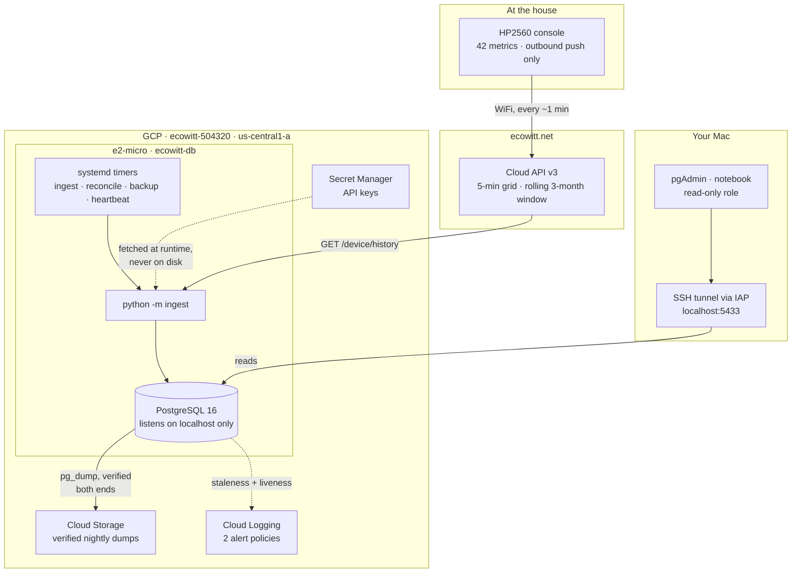
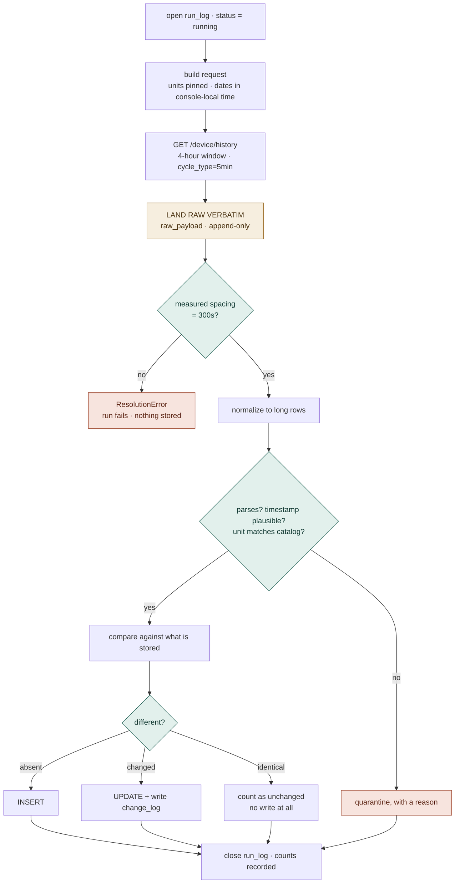
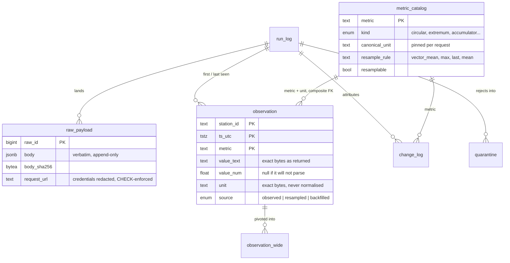
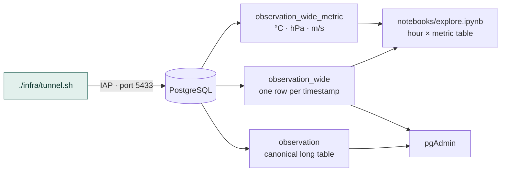

# Architecture

How data gets from the console to a query. Rendered version with commentary:
<https://claude.ai/code/artifact/63da25f0-c8a0-43e8-a0b6-a4fcc17400d5>

These diagrams render natively in GitHub and in VS Code's markdown preview.

## End to end

The console has no local API — it pushes to Ecowitt's cloud and nothing else, so the
pipeline pulls rather than listening on the LAN. Nothing accepts inbound connections:
Postgres binds to localhost, and SSH reaches the box only through an IAP tunnel.

## Inside one hourly run

The order is deliberate. Raw lands **before** validation, so a response that fails a
check can still be inspected. Resolution is verified **before** normalisation, so coarse
data never enters the curated table wearing a fine-grained label.

A run that changes nothing still writes a `run_log` row — absence of a row means the job
did not run, which is a different failure from a run that found nothing new.

## Where it lands

One row per (station, timestamp, metric). Long rather than wide because `change_log` is
field-level, so the table's key and the audit key are the same tuple — and adding a
sensor is two inserts rather than a migration.

## Getting it back out

Postgres never leaves localhost. The read-only role is refused writes twice over: by
grant, and by a forced read-only transaction default.

## The guards, and what each is for

| Guard | Prevents | Measured evidence |
|---|---|---|
| Spacing verification | Asking for 5-min data and silently getting 30-min, with a success code | Honored to 24 h; 48 h → 30 min, 30 d → 4 hour, all `code=0` |
| Console-local date framing | An empty result that looks like "no data" | UTC framing returns `code=0` and an empty body |
| 12-hour chunks | A 24 h window becoming 25 wall-clock hours on spring-forward | Not yet observed — arrives once a year |
| Composite FK `(metric, unit)` | A unit changing underneath stored history | `℃` rejected for a `ºF`-pinned metric |
| Exact unit bytes | Normalising `º` (U+00BA) to `°` (U+00B0) | Stored and read back as U+00BA |
| Change detection | A blind upsert making "unchanged" invisible | Re-run of one window: 0 ins, 0 upd, 1,794 unchanged |
| Append-only raw | Losing the original response to a parsing bug | Trigger raises on UPDATE/DELETE; verified |
| Quarantine | Dropping a malformed row unnoticed | 0 so far; every reject carries a reason |
| Per-metric resample rules | Averaging a wind direction into its opposite | 17 north-crossings in a day; 29.9° measured error |
| Heartbeat absence alarm | A dead machine looking like a quiet healthy one | Emits every 15 min; the alert fires on silence |

**The pattern behind all of them:** this API prefers returning nothing over returning an
error. A wrong unit ID, a mis-framed window, an over-wide span, a misspelled sensor group
— each comes back as `code=0` with a plausible body. Almost every guard converts one of
those silences into a loud failure.

## What runs unattended

| Timer | When | Does |
|---|---|---|
| `ecowitt-ingest` | hourly | Last 4 h; each 5-min point fetched ~4× |
| `ecowitt-reconcile` | 10:00 UTC | Previous 24 h in 2 × 12 h chunks |
| `ecowitt-backup` | 09:00 UTC | Dump → verify → upload → re-read size |
| `ecowitt-heartbeat` | every 15 min | Staleness check; logs every run, healthy or not |

Reconciliation runs an hour *after* the backup so a pass that rewrites values is captured
by the next night's dump rather than racing the current one.
